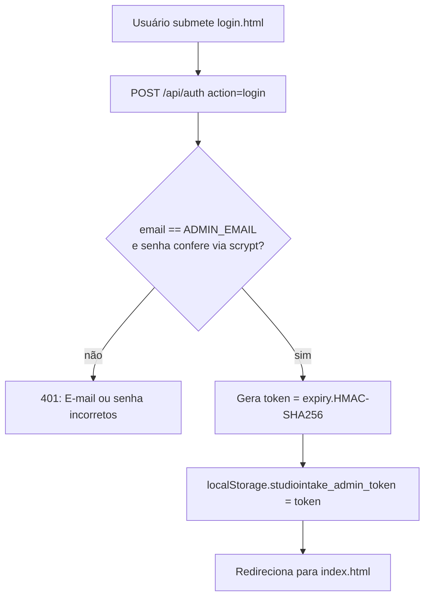
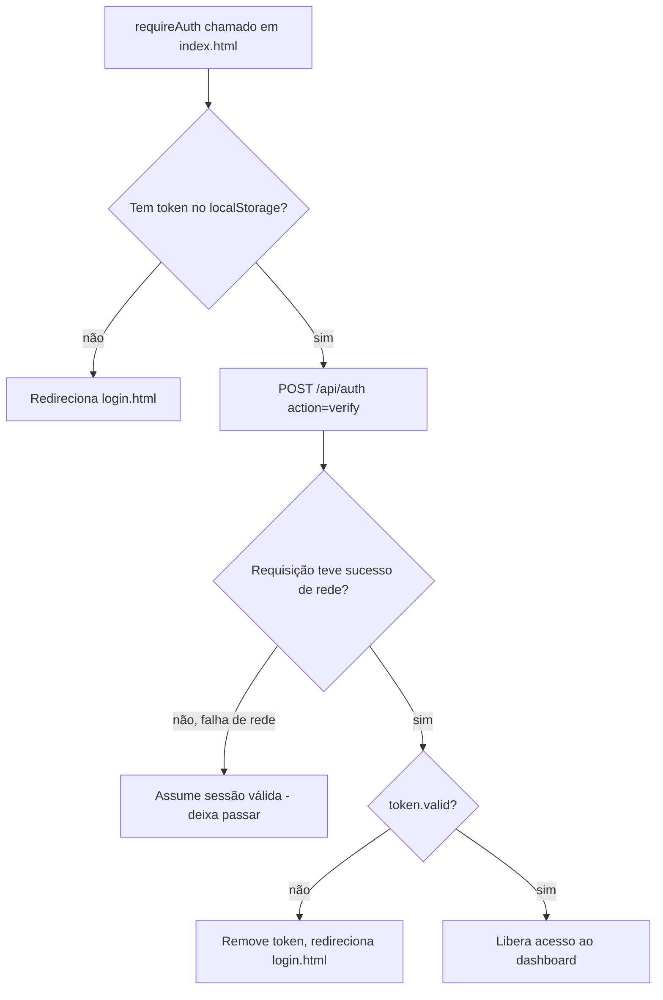
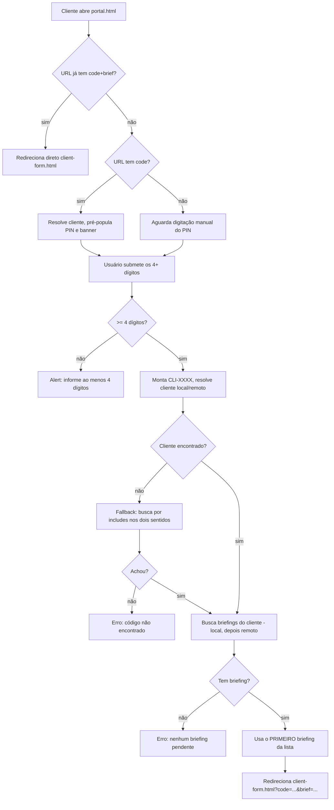

# Fluxograma — módulo `auth`

## Login do admin

```mermaid
flowchart TD
    A[Usuário submete login.html] --> B[POST /api/auth action=login]
    B --> C{email == ADMIN_EMAIL<br/>e senha confere via scrypt?}
    C -->|não| D[401: E-mail ou senha incorretos]
    C -->|sim| E[Gera token = expiry.HMAC-SHA256]
    E --> F[localStorage.studiointake_admin_token = token]
    F --> G[Redireciona para index.html]
```

## Verificação de sessão (dashboard)

```mermaid
flowchart TD
    A[requireAuth chamado em index.html] --> B{Tem token no localStorage?}
    B -->|não| C[Redireciona login.html]
    B -->|sim| D[POST /api/auth action=verify]
    D --> E{Requisição teve sucesso de rede?}
    E -->|não, falha de rede| F[Assume sessão válida - deixa passar]
    E -->|sim| G{token.valid?}
    G -->|não| H[Remove token, redireciona login.html]
    G -->|sim| I[Libera acesso ao dashboard]
```

## Acesso do cliente via PIN (portal)

```mermaid
flowchart TD
    A[Cliente abre portal.html] --> B{URL já tem code+brief?}
    B -->|sim| Z[Redireciona direto client-form.html]
    B -->|não| C{URL tem code?}
    C -->|sim| D[Resolve cliente, pré-popula PIN e banner]
    C -->|não| E[Aguarda digitação manual do PIN]
    D --> F
    E --> F[Usuário submete os 4+ dígitos]
    F --> G{>= 4 dígitos?}
    G -->|não| H[Alert: informe ao menos 4 dígitos]
    G -->|sim| I[Monta CLI-XXXX, resolve cliente local/remoto]
    I --> J{Cliente encontrado?}
    J -->|não| K[Fallback: busca por includes nos dois sentidos]
    K --> L{Achou?}
    L -->|não| M[Erro: código não encontrado]
    J -->|sim| N
    L -->|sim| N[Busca briefings do cliente - local, depois remoto]
    N --> O{Tem briefing?}
    O -->|não| P[Erro: nenhum briefing pendente]
    O -->|sim| Q[Usa o PRIMEIRO briefing da lista]
    Q --> R[Redireciona client-form.html?code=...&brief=...]
```
