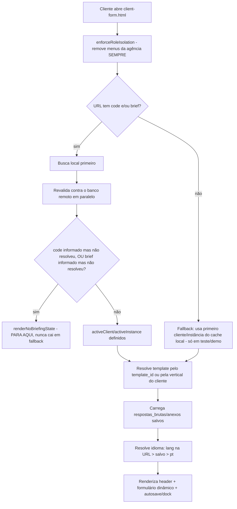
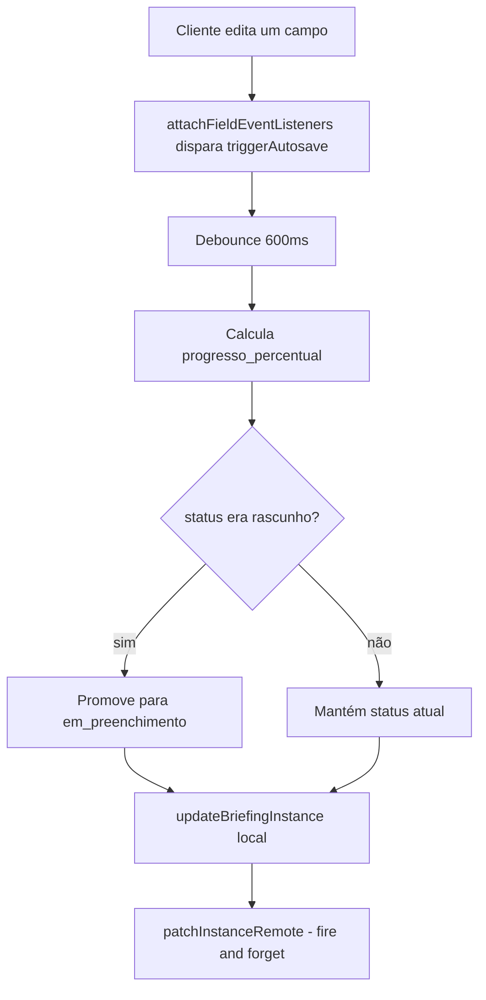
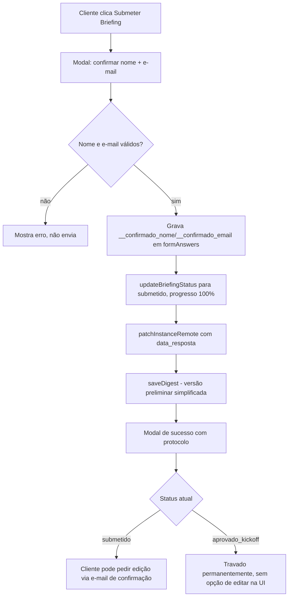

# Fluxograma — módulo `client-intake`

## Resolução zero-leakage do cliente/instância (initClientPortal)

```mermaid
flowchart TD
    A[Cliente abre client-form.html] --> B[enforceRoleIsolation - remove menus da agência SEMPRE]
    B --> C{URL tem code e/ou brief?}
    C -->|sim| D[Busca local primeiro]
    D --> E[Revalida contra o banco remoto em paralelo]
    E --> F{code informado mas não resolveu, OU brief informado mas não resolveu?}
    F -->|sim| G[renderNoBriefingState - PARA AQUI, nunca cai em fallback]
    F -->|não| H[activeClient/activeInstance definidos]
    C -->|não| I[Fallback: usa primeiro cliente/instância do cache local - só em teste/demo]
    H --> J[Resolve template pelo template_id ou pela vertical do cliente]
    I --> J
    J --> K[Carrega respostas_brutas/anexos salvos]
    K --> L[Resolve idioma: lang na URL > salvo > pt]
    L --> M[Renderiza header + formulário dinâmico + autosave/dock]
```

## Autosave

```mermaid
flowchart TD
    A[Cliente edita um campo] --> B[attachFieldEventListeners dispara triggerAutosave]
    B --> C[Debounce 600ms]
    C --> D[Calcula progresso_percentual]
    D --> E{status era rascunho?}
    E -->|sim| F[Promove para em_preenchimento]
    E -->|não| G[Mantém status atual]
    F --> H[updateBriefingInstance local]
    G --> H
    H --> I[patchInstanceRemote - fire and forget]
```

## Submissão final e travamento

```mermaid
flowchart TD
    A[Cliente clica Submeter Briefing] --> B[Modal: confirmar nome + e-mail]
    B --> C{Nome e e-mail válidos?}
    C -->|não| D[Mostra erro, não envia]
    C -->|sim| E[Grava __confirmado_nome/__confirmado_email em formAnswers]
    E --> F[updateBriefingStatus para submetido, progresso 100%]
    F --> G[patchInstanceRemote com data_resposta]
    G --> H[saveDigest - versão preliminar simplificada]
    H --> I[Modal de sucesso com protocolo]
    I --> J{Status atual}
    J -->|submetido| K[Cliente pode pedir edição via e-mail de confirmação]
    J -->|aprovado_kickoff| L[Travado permanentemente, sem opção de editar na UI]
```
