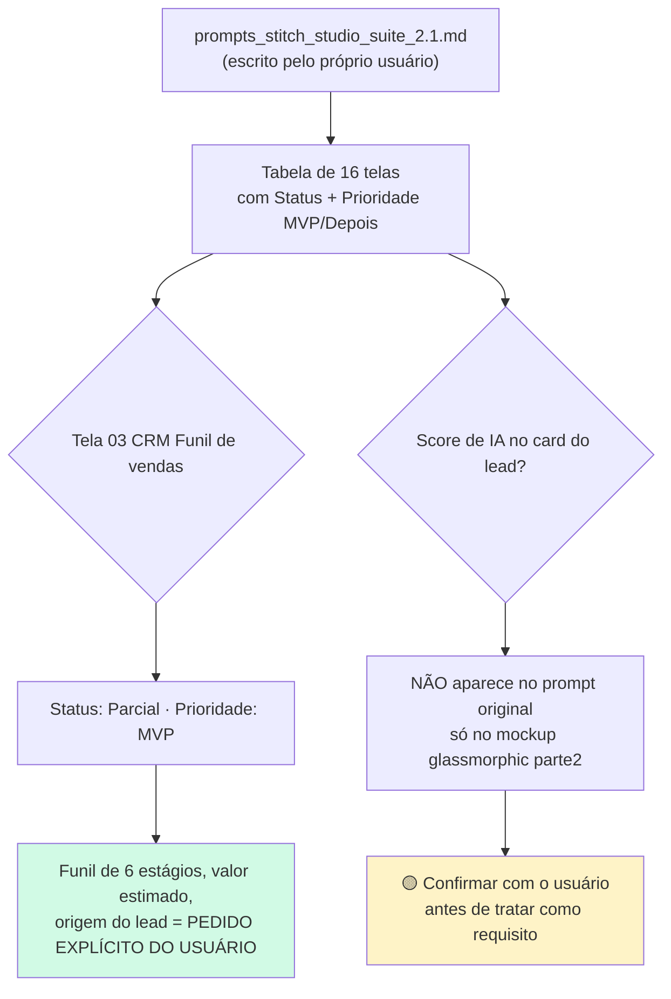
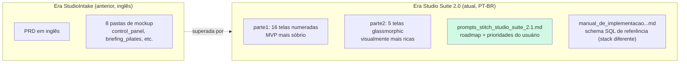

# Fluxograma — módulo `design-reference-stitch`

## Como o roadmap do próprio usuário resolve a dúvida do crm-funil

```mermaid
flowchart TD
    A["prompts_stitch_studio_suite_2.1.md\n(escrito pelo próprio usuário)"] --> B["Tabela de 16 telas\ncom Status + Prioridade MVP/Depois"]
    B --> C{Tela 03 CRM Funil de vendas}
    C --> D["Status: Parcial · Prioridade: MVP"]
    D --> E["Funil de 6 estágios, valor estimado,\norigem do lead = PEDIDO EXPLÍCITO DO USUÁRIO"]
    B --> F{Score de IA no card do lead?}
    F --> G["NÃO aparece no prompt original\nsó no mockup glassmorphic parte2"]
    G --> H["🟡 Confirmar com o usuário\nantes de tratar como requisito"]
    style E fill:#d1fae5
    style H fill:#fef3c7
```

## Camadas de material de design preservadas

```mermaid
flowchart LR
    subgraph Era1["Era StudioIntake (anterior, inglês)"]
        A1[PRD em inglês]
        A2["8 pastas de mockup\ncontrol_panel, briefing_pilates, etc."]
    end
    subgraph Era2["Era Studio Suite 2.0 (atual, PT-BR)"]
        B1["parte1: 16 telas numeradas\nMVP mais sóbrio"]
        B2["parte2: 5 telas glassmorphic\nvisualmente mais ricas"]
        B3["prompts_stitch_studio_suite_2.1.md\nroadmap + prioridades do usuário"]
        B4["manual_de_implementacao...md\nschema SQL de referência (stack diferente)"]
    end
    Era1 -.superada por.-> Era2
    style B3 fill:#d1fae5
```
